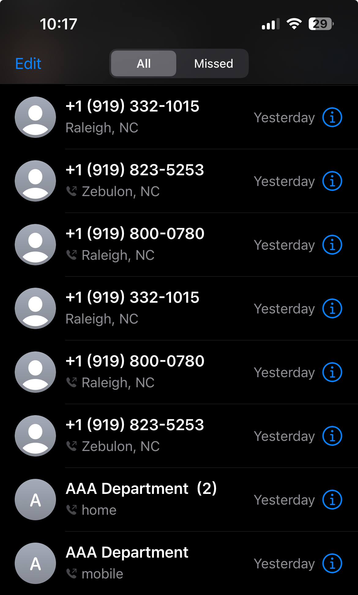
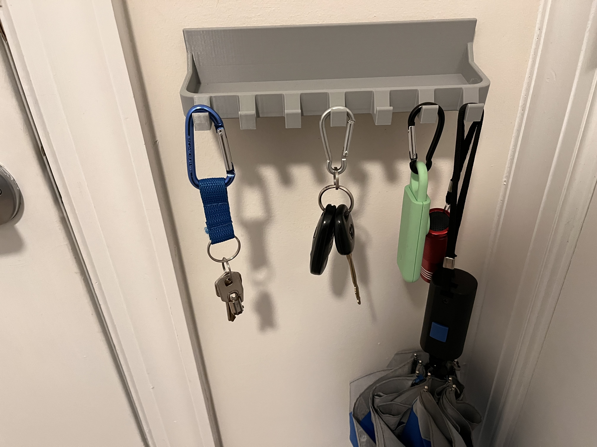
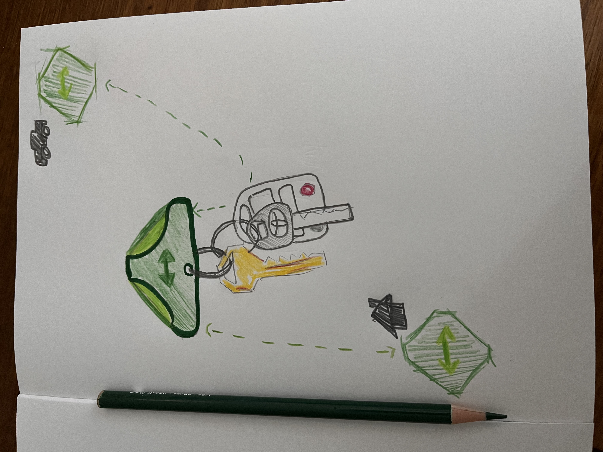
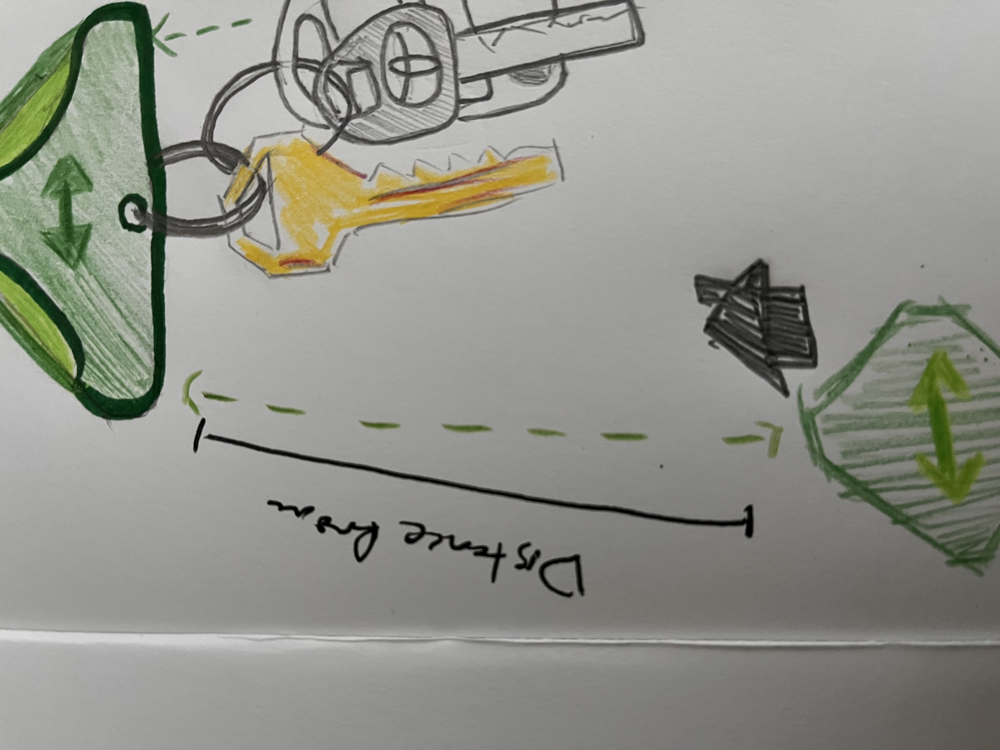
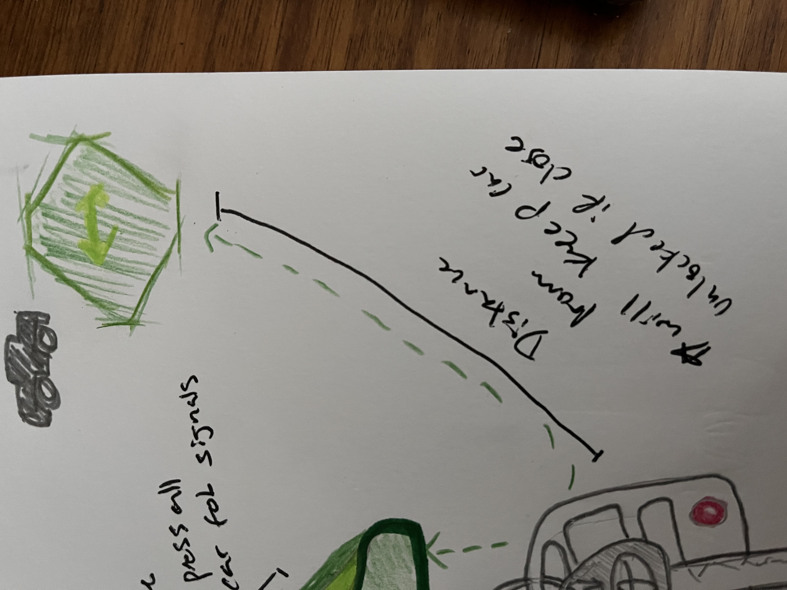
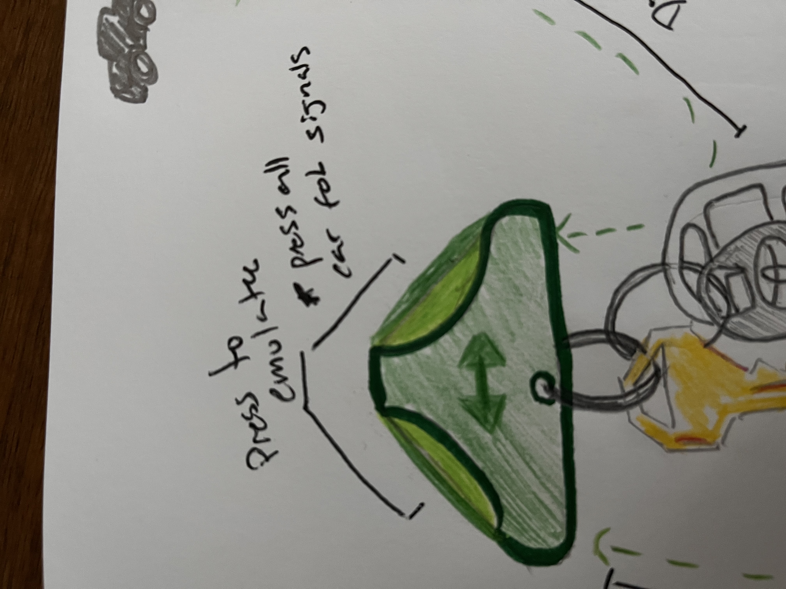
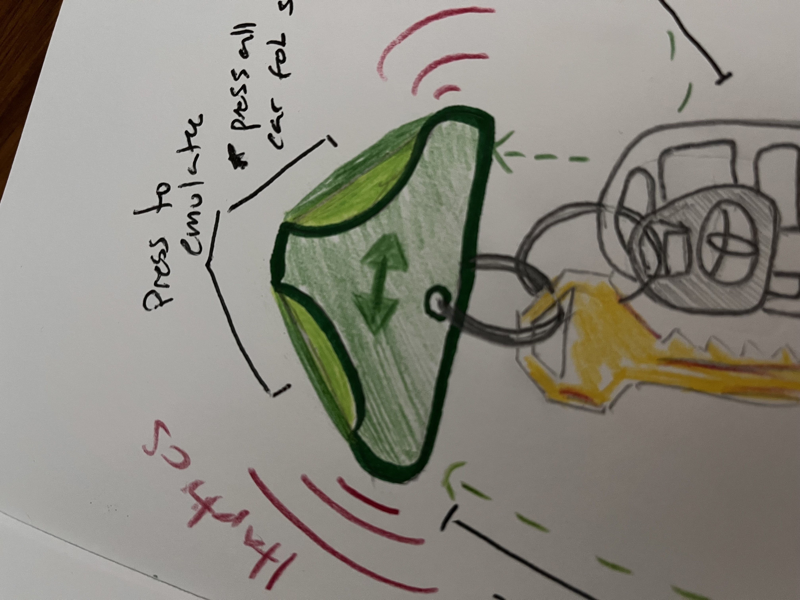

# Object: Key Fob/Ring
*A cluster keys and/or an electronic fob used to access homes/vehicles/buildings/etc.*

**A quick story:** This weekend I drove to Trader Joe's, it was sleeting out, and pretty frigid. I like to think myself well organized, but for some reason, instead of checking to make sure I grabbed the right keys before leaving my car, I tapped my pocket, felt keys, hit the door lock, and went about my shopping. Only to find out later that I left my car keys in the cupholder and grabbed my house keys.

## Object Analysis & Missing Affordances
### Awareness Gaps:
**No Awareness of it's own location**
* Use Scenario
    - User is leaving home/car/building and wants to ensure they have their keys
* The Gap
    - The key ring or fob has no knowledge of where it is relative to the user. If misplaces the user finds out later.
* Opportunity
    - Key could ring, to reduce phone connectivity requirements there could be other nodes that the key pings off of
### Feedback Gaps: 
**Poor confirmation of actions**
* Use Scenario
    - Trying to find car in noisy or large parking lot
    - Forgetting what beep means locking or unlocking
    - Forgetting key in the car
    - Forgetting to lock home/house
* The Gap
    - Feedback is ambiguous, inaudible, or non-existent
* Opportunity
    - Provide haptic feedback when action is performed or not performed
    - Send a signal to car fob (already existing one) to unlock the car if close to the car node. (imagining this is the different nodes idea)
    - There could be one key for all locks, an ecosystem, where the car key fob signals are copied, and the house locking system is converted.
* Justification
    - Ambiguous feedback can lead to multiple presses, accidentally setting off the alarm
    - Does not solve the "forgetting" of keys issue
    - Battery dying is not indicated
### Adaptation Gaps: 
**1. Everyone doesn't have high tech locks**
* Use Scenario
    - User wants to upgrade their locking experience but have standard locks and an older car.
* The Gap
    - Additional technology may not help users with standard items
* Opportunity
    - Key ring that interprets the signal coming from car fobs
    - A kit comes with different nodes to interpret location (one for home, car, office, etc.)
* Justification
    - Users with standard keys and locks can benefit from technological upgrades and ensure that lockouts and forgetfulness is reduced significantly.
**2. Keys don't change for the user**
* Use Scenario
    - Different users share keys
* The Gap
    - the key ring behaves identically for all users regardless of different needs
* Opportunity
    - The key ring could adapt feedback intensity
    - change behavior dependent on location
* Justification 
    - Personalization improves comfort and accessibility, and complexity can be managed through presets
### Anticipation Gaps: 
**A purely unreactive object**
* Use Scenario
    - User leaves home/car and realizes they forgot their keys
* The Gap
    - They key waits for the interaction but never intervenes
* Opportunity
    - detect patterns
    - alert if users depart without them
    - come with a kit that will unlock the home if they are still inside.
* Justification 
    - Prevents common failurs, proactive alerts or actions.

### Social Fit Gaps: 
**Paying a locksmith dumb money or socially awkward situations**
* Use Scenario
    - User loses keys and needs to explain delays or access issues
* The Gap
    - the key ring offers no way to recover or share access
* Opportunity
    - delegate digital access (temp)
    - recovery mode
    - integrate with family accouts (like apple family icloud)
* Justification 
    - A lot of modern solutions already expect flexible access

## Why not leave it alone?
This may be biased based on my very recent experience but...
Keys continue because of the established integration of locks, the unwillingness and financial toll that a full system upgrade would require, and just because they are simple/reliable. 
Any added needs:
- battery dependency
- privacy concerns
- increase for potential failure

becomes potential risks.
However, the gaps above target high-frequency failure moments, where small intelligence or connectivity could benefit the common user.

## Proposed Redesign

### Design Rationale: 
A summary of which gaps you're addressing and why they matter. If you identified gaps that you chose not to address, briefly explain why. 

* Addressed:
    * Gap 1: Old car fobs don't know they are in the car.
        - Upgrading doesn't need to mean a new car or new security system, it could just mean that the fob is emulated and has a distance metric added. and again personal bias. 
    * Gap 2: Standard keys don't allow for flexible access 
        - Emulation of multiple items, like a work fob that was forgotten at home.
* Not Addressed:
    * Gap 1: Pattern recognition
        - Keys should have to be charged. I didn't want this to be another technological upgrade that becomes a hassle.

### Proposed Features: 
Specific sensors, actuators, or ML capabilities integrated into your redesign (e.g., capacitive touch, accelerometers, computer vision, predictive models). If you're proposing ML, explain why threshold-based logic wouldn't suffice. 

Imagining this is a kit that someone can buy, potentially an ecosystem:
* Initial Kit:
    - 1 Key ring fob (User centered)
        - Haptic capabilities
        - Emulation of different signals
        - Proximity sensors
        - buttons to initiate an emulation
    - 3 Item identifiers/locators
        - Output signal for distance/proximity sensor on key ring
* Other items not completely explored:
    - When keys are left in the home, there should be a way for the home to be unlocked.
        - a permanent device connected to the door to unlock it if the keys are still inside the home

### Social Considerations: 
How does your redesign perform against the framework from class? Consider: 
- Does it replace an existing habit or require new behavior?
    - It does not require consistent new behavior, unless car keys and home keys are usually separated for the user.
    - It should seemlessly integrate into someones life. The fob would use a physical battery and indicate through haptics when it is low.
- Is it invisible/normalized or performative? 
    - It is nearly invisible. People already put trinkets on their keys. This would raise any questions and works in the background,
- What's the social cost of using it? Does it require explanation?
    - There is no social cost.

### Tradeoff Analysis: 
What new failure modes, costs, or complexities does your redesign introduce? 
- Safety concerns
    - When driving/sitting in the car locks should not be affected by the emulation.
    - People emulation someone elses car keys without their permission.