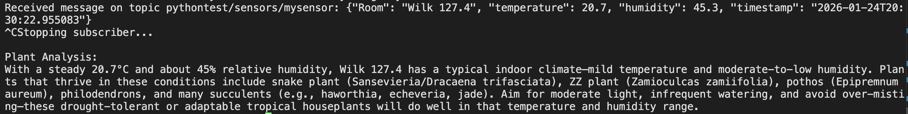

# Project Description
Minimally altered from the example provided in class, this MQTT communicates between `pub.py` and `sub.py`. The Publisher sends a message of sample data, pretending its a building master unit in Wilkinson accessing sensor data from every room on the first floor. The Subscriber receives the message and sends in to `gpt-5-mini` for interpretation. The LLM component analyzes the provided sensor data and outputs the best plants for each room.



# Set Up

## Get Duke AI API Key
*put it in a .env file and gitignore*

https://dashboard.ai.duke.edu/
https://litellm.oit.duke.edu/#/

## Create & Activate Virtual Env
```python3 -m venv venv```
```source ./.venv/bin/activate```

## Install dependencies (python3 -m pip install [dependency name])
```pip install paho-mqtt```

```pip install openai```

```pip install dotenv```
## Run
```
python pub.py
```
```
python sub.py
```